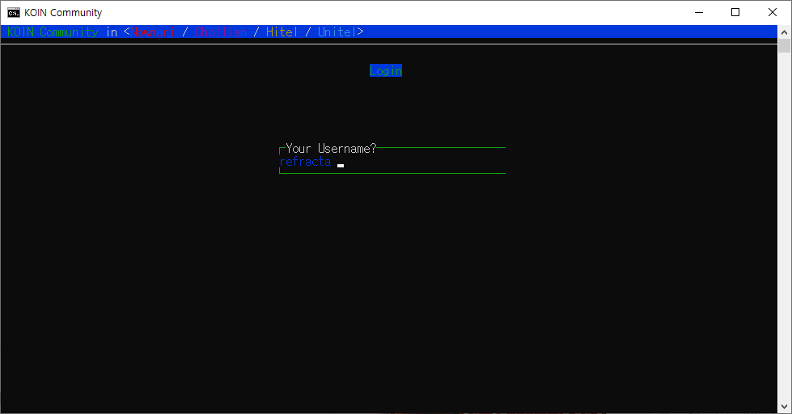
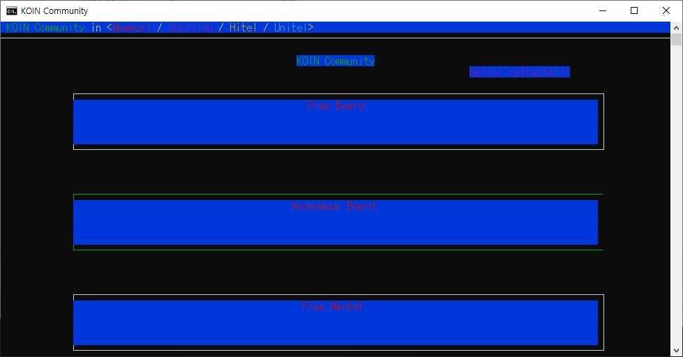
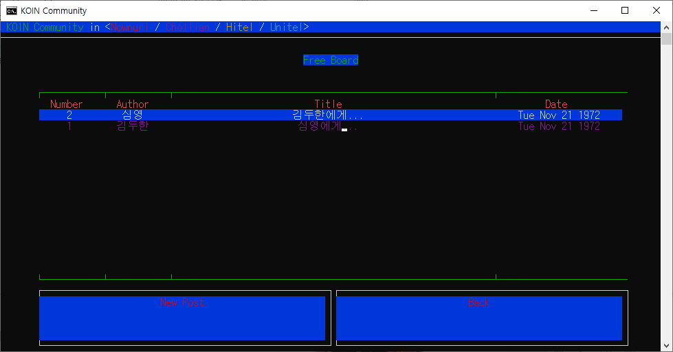
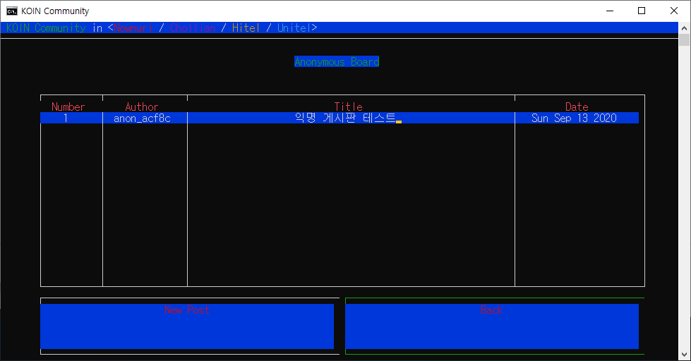
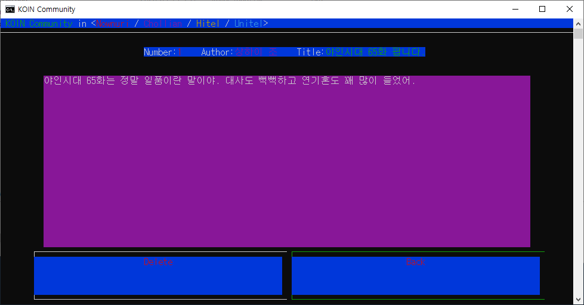
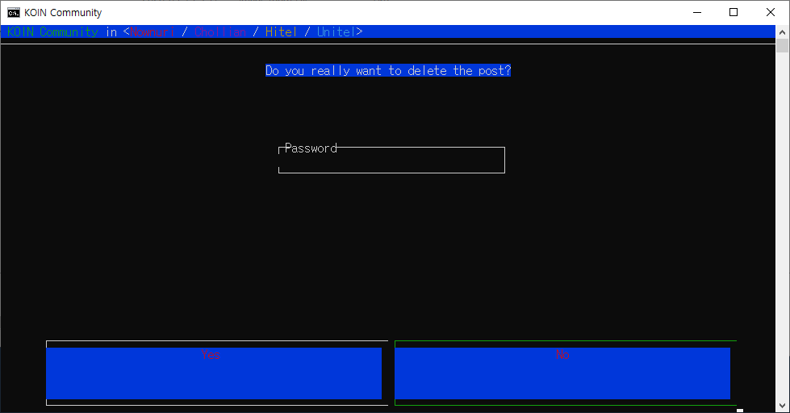

# 문제 1. 게시판 만들기 - BCSDLab Coding Test
코인-한기대 커뮤니티에는 자유게시판, 익명게시판, 취업게시판 총 3가지 게시판이있다. 코인이는 클론 코딩으로 게시판을 구현을 해보려고 한다. 

전체 3가지 메뉴가 있다. 게시판 조회, 작성, 삭제가 있다.
## 조회
게시판은 게시글 목록을 보여주며 게시글 목록은 게시글제목, 작성자, 작성일이 포함되어 있다.

게시글은 작성자, 게시글 내용이 포함되어 있다.
## 작성
게시판에서 글을 작성할시 3개중 하나의 게시판을 선택을 하고 글을 입력하도록 한다.

제목, 글중 하나의 내용이 비어있을때 저장이 안되도록 한다.

익명게시판 인 경우 작성시 비밀번호를 입력을 해주어야 한다.
## 삭제
게시판에서 글을 작성할시 3개중 하나의 게시판을 선택을 하고 글을 삭제하도록 한다.

삭제 방법은 자유롭게 구현을 해도 된다. (ex) id 사용, 제목으로 삭제 등..)

익명 게시판인 경우 작성 및 삭제시 비밀번호를 요구하게 된다.

이 프로그램은 데이터베이스 또는 파일입출력을 사용하지 않는다. 즉 1회성 프로그램이다.

예로 프로그램 실행 시 게시글을 작성하고 저장하더라도 종료 후 다시 실행시에는 초기화되어 저장된 게시글이 없다.

그렇기에 테스트시 작성 -> 조회 -> 삭제순으로 하면 된다.

## 유의사항
모든 프로그램은 객체지향적으로 설계되어야 한다.

문제에 제시 되어 있는 기능말고도 본인의 역량에 따라 더 기능을 추가해도 좋다.

언어는 C++ / Java 등 본인이 편한 언어를 선택하여 작성하며, 결과물은 소스코드 파일만 제출한다.

파일은 꼭 한개의 파일만 제출 하지 않아도 된다.

읽는 사람을 생각하여 가독성이 높은 코드 및 적절한 주석을 넣어야 한다.

## 설치 방법
```
git clone https://github.com/refracta/pseudo-koin-bbs
npm install
npm start
```

## 실행 화면
> ## 로그인
> 
>
> ## 메인
> 
> ## 게시판
> 
> 
> ## 게시글
> 
> ## 게시글 삭제
> 
